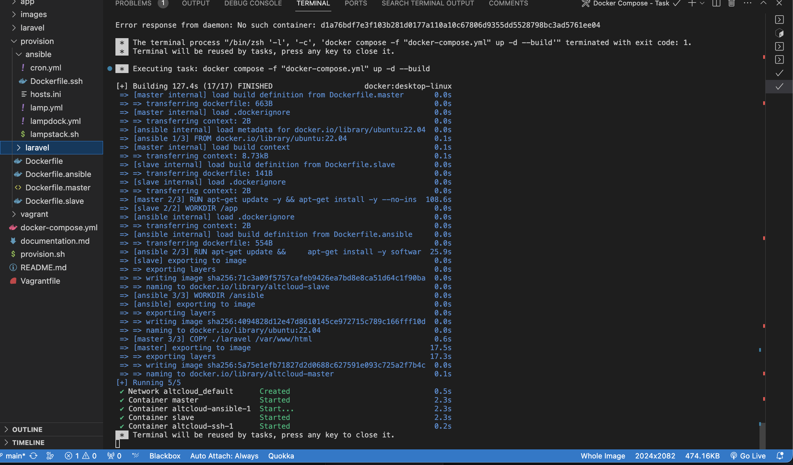
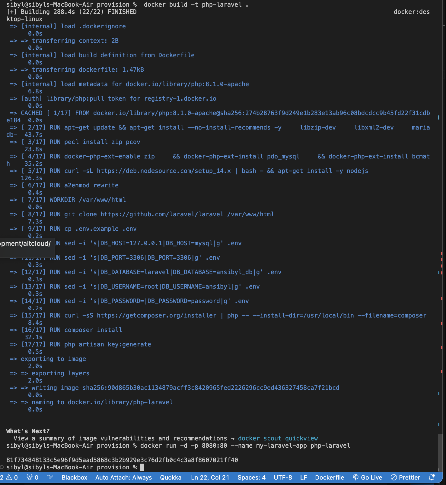
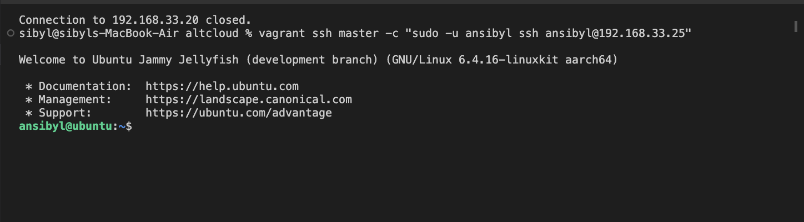
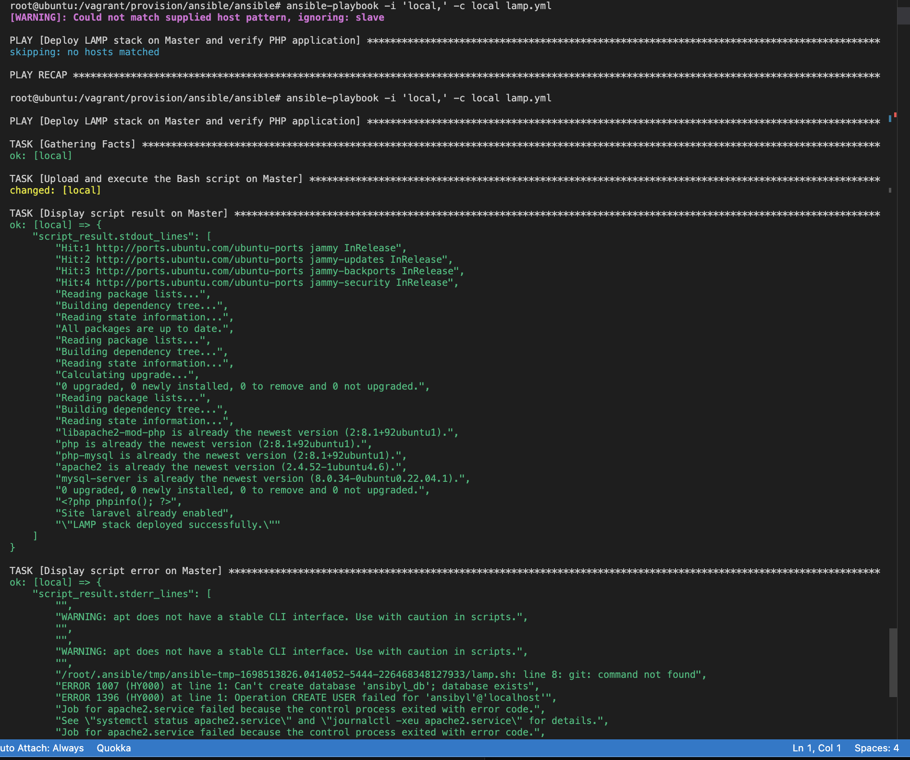

Project: Automating LAMP Stack Deployment
Objective
The goal of this project is to automate the provisioning of two Ubuntu-based servers, "Master" and "Slave," using Vagrant. We will create a reusable and readable bash script for deploying a LAMP (Linux, Apache, MySQL, PHP) stack on the Master node. Additionally, we will use Ansible to execute the script on the Slave node and verify the accessibility of a PHP application deployed via the VM's IP address. Finally, we will create a cron job to check the server's uptime daily.

Dockerized LAMP Stack Deployment
i'm using docker as my deploy container. it's great for its flexibility and compatibility with different system architectures, including arm64 silicon. You can create container images for your applications and run them without the need for traditional virtualization tools like VirtualBox or VMware etc.
so lets build a quick docker and choose the enviroments


```
# Use a base image with Ubuntu as the operating system
FROM php:7.4-apache

# Update the package repositories and install necessary packages
RUN apt-get update && apt-get install -y \
    apache2 \
    mysql-server \
    php \
    php-common \
    php-xml \
    php-mysql \
    php-gd \
    php-mbstring \
    php-tokenizer \
    php-json \
    php-bcmath \
    php-curl \
    php-zip \
    unzip


#Installing Puppet and Ansible:

RUN apt-get -y install puppet: Install Puppet
RUN apt-get install software-properties-common: Install required software properties
RUN apt-add-repository --yes --update ppa:ansible/ansible and apt-get install -y ansible

# Set the working directory
WORKDIR /var/www/html
RUN chown www-data:www-data /var/www/html; \
	chmod 777 /var/www/html

# Copy the .htaccess file to the container
COPY .htaccess .htaccess

# Copy your bash script to the container
COPY your_script.sh /usr/local/bin/

# Make your script executable
RUN chmod +x /usr/local/bin/slave.sh

# Expose port 80 to the host machine
EXPOSE 22
EXPOSE 80

# Start the necessary services and your script when the container runs
CMD ["apache2-foreground"]

```




then next is the complimentary docker-compose to pull the docker images we built


```
services:
  lamp_mysql:
    image: mysql
    environment:
      MYSQL_ROOT_PASSWORD: mpassword
      MYSQL_DATABASE: ansibyl
    networks:
      - lamp_network

  lamp_apache:
    image: httpd
    ports:
      - "80:80"
    volumes:
      - "/path/to/your/html:/usr/local/apache2/htdocs"
    networks:
      - lamp_network
    depends_on:
      - lamp_mysql

  lamp_php:
    image: php:apache
    volumes:
      - "/var/www/html:/var/www/html"
    networks:
      - lamp_network
    depends_on:
      - lamp_apache





```
:#-*- mode: ruby -*-
#vi: set ft=ruby :

Vagrant.configure("2") do |config|
  config.vm.hostname = "ubuntu"

  config.vm.provider :docker do |docker|
    docker.image = "rofrano/vagrant-provider:ubuntu"
    docker.remains_running = true
    docker.has_ssh = true
    docker.privileged = true
    docker.volumes = ["/sys/fs/cgroup:/sys/fs/cgroup:rw"]
    docker.create_args = ["--cgroupns=host"]
    # Uncomment to force arm64 for testing images
    # docker.create_args = ['--platform=linux/arm64']
  end


  config.vm.define "master" do |master|
    master.vm.network "private_network", type: "dhcp"
    #master.vm.provision "shell", path: "master.sh"
  end

  config.vm.define "slave" do |slave|
    #slave.vm.network "private_network", type: "dhcp"
  end
end


you can link a quick bash to the master path to help with installing updates soon as you sshto help set the enviroment permisions and delegations

!/bin/bash

 Update package information
vagrant ssh master -c "sudo apt-get update"

#setup master user
vagrant ssh master -c "sudo useradd -m -s /bin/bash ansibyl"
vagrant ssh master -c "sudo usermod -aG sudo ansibyl"
vagrant ssh master -c "echo 'ansibyl:password' | sudo chpasswd"

#setup slave user
vagrant ssh slave -c "sudo useradd -m -s /bin/bash ansibyl"
vagrant ssh slave -c "sudo usermod -aG sudo ansibyl"
vagrant ssh slave -c "echo 'ansibyl:password' | sudo chpasswd"


to this steps requires us to get on the Master node and create a bash script to automate the deployment of a LAMP (Linux, Apache, MySQL, PHP) stack.
and deploy it on the slave, so we need tons of permissions and file transfer between the nodes so we need to se those precussors to permit all that moving parts

#Generate SSH key on master
vagrant ssh master -c "sudo -u ansibyl ssh-keygen -t rsa"

#Update /etc/hosts on master to include slave
vagrant ssh master -c "echo '192.168.33.25 slave' | sudo tee -a /etc/hosts"

#Copy public key from master to slave
vagrant ssh master -c "sudo -u ansibyl ssh-copy-id ansibyl@192.168.33.25"

#Set proper permissions for the 'ansibyl' user's .ssh directory and key files on master
vagrant ssh master -c "sudo chown -R ansibyl:ansibyl /home/ansibyl/.ssh && sudo chmod 700 /home/ansibyl/.ssh && sudo chmod 600 /home/ansibyl/.ssh/id_rsa"

#Generate SSH key on slave
vagrant ssh slave -c "sudo -u ansibyl ssh-keygen -t rsa"

#Update /etc/hosts on slave to include master
vagrant ssh slave -c "echo '192.168.33.20 master' | sudo tee -a /etc/hosts"

#Copy public key from slave to master
vagrant ssh slave -c "sudo -u ansibyl ssh-copy-id ansibyl@192.168.33.20"

#Set proper permissions for the 'ansibyl' user's .ssh directory and key files on slave
vagrant ssh slave -c "sudo chown -R ansibyl:ansibyl /home/ansibyl/.ssh && sudo chmod 700 /home/ansibyl/.ssh && sudo chmod 600 /home/ansibyl/.ssh/id_rsa"




```
#Create the 'ansible' directory on both 
vagrant ssh master -c "sudo -u ansibyl mkdir -p /home/ansibyl/scripts /home/ansibyl/logs"
vagrant ssh slave -c "sudo -u ansibyl mkdir -p /home/ansibyl/scripts /home/ansibyl/logs"

#Append shebang and create a deployment script called 'master.sh' on the master node
vagrant ssh master -c "sudo su ansibyl -c 'echo \"#!/bin/bash\" > /home/ansibyl/scripts/slave.sh'"


slave.sh is for the slave
This script d clones a PHP application from GitHub, install all necessary packages, and configure Apache web server and MySQL.


```
#update server and get apache web server a
sudo apt-get install apache2 -y
sudo service apache2 start

#Install mysql and go through the setup. 
sudo apt-get install mysql-server -y
sudo /usr/bin/mysql_secure_installation
sudo apt-get update && sudo apt-get install ansible -y"

#Install PHP
sudo apt-get install php -y
sudo apt-get install php-mysql -y
sudo apt-get install libapache2-mod-php -y
sudo apache2ctl -M
sudo a2dismod mpm_event
sudo a2enmod mpm_prefork
sudo a2enmod php7.2
sudo /etc/init.d/apache2 restart

#CLONE LARAVEL APPLICATION AND DEPENDENCIES
mkdir /var/www/html/laravel
cd /var/www/html/laravel
cd /var/www/html
sudo git clone https://github.com/laravel/laravel.git
cd /var/www/html/laravel
composer install --no-dev 


#SET PERMISSIONS
sudo chown -R www-data:www-data /var/www/html/laravel
sudo chmod -R 775 /var/www/html/laravel
sudo chmod -R 775 /var/www/html/laravel/storage
sudo chmod -R 775 /var/www/html/laravel/bootstrap/cache

#CONFIGURATION OF PHP
sudo sed -i 's/cgi.fix_pathinfo=1/cgi.fix_pathinfo=0/' /etc/php/8.2/apache2/php.ini
sudo systemctl restart apache2

#INSTALL COMPOSER
sudo apt install curl -y 
sudo curl -sS https://getcomposer.org/installer | php 
sudo mv composer.phar /usr/local/bin/composer 
composer --version 


#CONFIGURATION  laravel in APACHE2  sites available 
cat << EOF > /etc/apache2/sites-available/laravel.conf
<VirtualHost *:80>
    ServerAdmin webmaster@localhost
    ServerName 192.168.30.25
    DocumentRoot /var/www/html/laravel/public
    <Directory /var/www/html/laravel>
        Options Indexes MultiViews FollowSymLinks
        AllowOverride All
        Require all granted
    </Directory>
    ErrorLog \${APACHE_LOG_DIR}/error.log
    CustomLog \${APACHE_LOG_DIR}/access.log combined
</VirtualHost>
EOF

sudo a2enmod rewrite 
sudo a2ensite laravel.conf
sudo systemctl restart apache2

cd /var/www/html/laravel
sudo cp .env.example .env
php artisan key:generate

# CONFIGURING MYSQL: CREATING USER AND DATABASE
commands=("CREATE DATABASE ansibyldb;" "CREATE USER 'ansibyl'@'localhost' IDENTIFIED BY 'password';" "GRANT ALL PRIVILEGES ON ansibyldb.* TO 'ansibyl'@'localhost';" "FLUSH PRIVILEGES;")

for ((i = 0; i < ${#commands[@]}; i++)); do
    result=$(sudo mysql -e "${commands[i]}")
    echo "Command $((i+1)): ${commands[i]}"
    echo "Result: $result"
done

# CACHE CONFIG
php artisan config:cache
cd /var/www/html/laravel
php artisan migrate

#Set ServerName in Apache configuration
sudo bash -c 'echo \"ServerName localhost\" >> /etc/apache2/apache2.conf'

#Restart Apache
sudo service apache2 restart

#Display deployment completion message
echo \"LAMP stack deployed successfully.\


# now we push this from master to the slave node 

 ```
#Copy 'master.sh' to the slave node
vagrant ssh master -c "sudo -u ansibyl scp /home/ansibyl/scripts/master.sh ansibyl@slave:/home/ansibyl/scripts/"


good, now before we deploy that we need a playbook for the maestreo to execute 
Using an Ansible playbook:
Execute the bash script on the Slave node and verify that the PHP application is accessible through the VM's IP address (take screen of this as evidence)
Create a cron job to check the server's uptime every 12 am.


```
- name: Deploy LAMP stack on slave and verify PHP application
  hosts: all
  become: yes
  tasks:
    - name: copy the bash script to the slave machine
      ansible.builtin.copy:
        src: cronslave.sh
        dest: ~/
        owner: root
        group: root
        mode: '0744'

    - name: Upload and execute the Bash script on slave
       script: /home/ansibyl/scripts/cronslave.sh
        delegate_to: slave
       register: script_result

    - name: Display script result on master
       debug:
        var: script_result.stdout_lines
      when: script_result is defined and script_result.stdout_lines | length > 0

    - name: Display script error on master
       debug:
        var: script_result.stderr_lines
       when: script_result is defined and script_result.stderr_lines | length > 0

    - name: Verify PHP application on master
       uri:
        url: "http://localhost/"
        status_code: 200
      register: result

    - name: Display verification result on master
       debug:
        var: result


if you prefer automatic routing to localhost with minimal port conflicting you can use `ansible-playbook -i 'local,' -c local your_playbook.yml` to deploy your playbook without adding `inventory.ini` or `hosts.ini` to the pull.



set up the cron playbook

```
 #cron job to check the server's uptime every 12 am.
- name: Cronus
  hosts: all
  become: yes
  environment:
    PATH: "/usr/local/sbin:/usr/local/bin:/usr/sbin:/usr/bin:/sbin:/bin:/snap/bin"
  tasks:
    - name: Create a cron job to run the uptime check script every day at 12 am
      cron:
        name: "Run Uptime Check at 12 am"
        minute: "0"
        hour: "0"
        job: "/home/ansibyl/scripts/uptime.sh >> /home/ansibyl/logs/uptime.log 2>&1"
        state: present

    - name: Run the Uptime Check Script
      ansible.builtin.command: /home/ansibyl/scripts/uptime.sh
      async: 0
      poll: 0
      register: script_result

    - name: Send an email with the Uptime Check result
      mail:
        host: localhost
        port: 25
        subject: "Uptime Check Result"
        to: "testsybil.dev@gmail.com"
        body: "The uptime check cron job executed successfully. Result:\n{{ script_result.stdout }}"
      delegate_to: localhost

```

  you can have a set up a quick little uptime script to add to the playbook


uptime.sh for cron
#!/bin/bash

#Get the uptime of the server
uptime=$(uptime -p)

#Send an email with the uptime
echo "Server uptime: $uptime" | mail -s "Server Uptime Report" testsybil.dev@gmail.com


you should b able to view the laravel web app if you use the same ip attached to your `ServerName`

)


